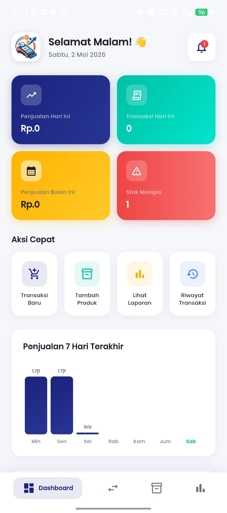
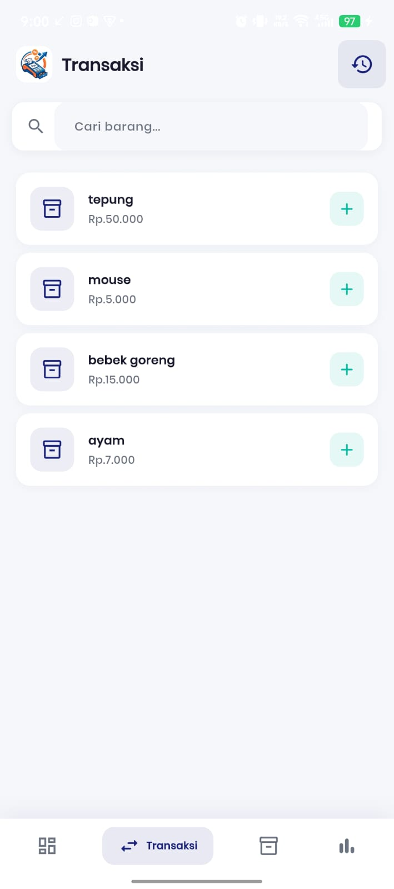
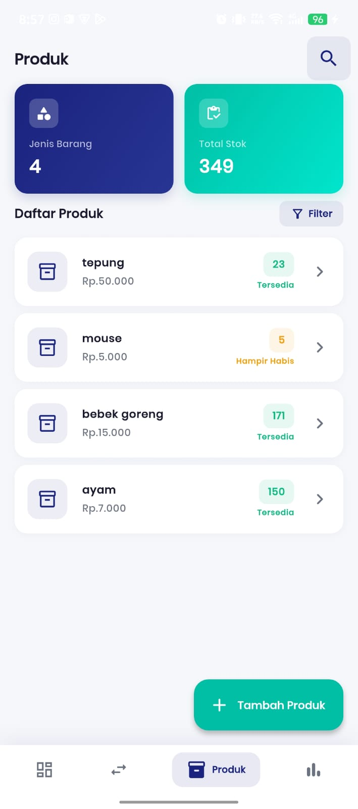

# Kasir Kilat

Kasir Kilat adalah aplikasi Point of Sales (POS) / Kasir digital modern yang dirancang khusus untuk UMKM (Usaha Mikro, Kecil, dan Menengah). Aplikasi ini dibangun dengan menggunakan arsitektur yang bersih, antarmuka yang elegan (tema Dark Navy & Teal), dan dukungan database real-time.

## 📸 Screenshot Aplikasi
> **Catatan untuk Screenshot:** 
> *(Silakan kirimkan screenshot aplikasi (Dashboard, Transaksi, Produk, Laporan) di chat, atau letakkan gambar tersebut di folder `assets/` dengan nama `dashboard.png`, `transaksi.png`, dll., lalu kita bisa mengupdate bagian ini.)*

<div align="center">
  
  &nbsp;&nbsp;&nbsp;&nbsp;
  
  &nbsp;&nbsp;&nbsp;&nbsp;
  
</div>

## ✨ Fitur Utama

Aplikasi ini memiliki 4 pilar fitur utama yang dapat diakses melalui navigasi bawah:

1. **📊 Dashboard**
   - Ringkasan performa bisnis.
   - Akses cepat ke metrik penting toko.
2. **💱 Transaksi**
   - Pencatatan transaksi penjualan secara real-time.
   - Manajemen keranjang belanja yang cepat dan responsif.
3. **📦 Manajemen Produk (Barang)**
   - Tambah, Edit, dan Hapus (CRUD) produk.
   - Sinkronisasi otomatis dengan database cloud.
4. **📈 Laporan**
   - Visualisasi data penjualan (Bar Charts).
   - Pembuatan (generate) dokumen PDF untuk laporan penjualan.

**Fitur Tambahan:**
- **Real-time Synchronization:** Menggunakan Firebase Cloud Firestore untuk sinkronisasi data antar perangkat.
- **Local Notifications:** Notifikasi lokal untuk pengingat atau aksi tertentu.
- **Camera Integration:** Pengambilan gambar langsung dari dalam aplikasi.
- **Pull-to-Refresh:** Pembaruan data manual dengan gestur tarik layar ke bawah/atas.

## 🛠️ Teknologi & Arsitektur

- **Framework:** [Flutter](https://flutter.dev/) (SDK >=3.4.0 <4.0.0)
- **State Management:** [GetX](https://pub.dev/packages/get)
- **Database & Storage:** [Firebase Cloud Firestore](https://firebase.google.com/docs/firestore) & [Firebase Storage](https://firebase.google.com/docs/storage)
- **UI & Styling:** Custom Theme (AppColors & AppTheme) dengan sentuhan warna *Navy* dan *Teal*. Lottie untuk animasi.
- **Lainnya:**
  - `intl` untuk format tanggal dan mata uang.
  - `responsive_grid` untuk layout grid dinamis.
  - `flutter_slidable` untuk interaksi geser pada list.

## 🚀 Memulai (Getting Started)

### Prasyarat
- Flutter SDK (Versi terbaru disarankan, >=3.4.0)
- Android Studio / VS Code
- Akses ke Firebase Project (file `google-services.json` untuk Android atau `GoogleService-Info.plist` untuk iOS sudah harus terkonfigurasi)

### Instalasi & Menjalankan Aplikasi

1. **Clone repositori ini** (jika menggunakan git):
   ```bash
   git clone <url-repo-anda>
   cd cashier-master\ tubes
   ```

2. **Unduh seluruh dependensi:**
   ```bash
   flutter pub get
   ```

3. **Jalankan aplikasi** di emulator atau perangkat fisik:
   ```bash
   flutter run
   ```

## 📁 Struktur Proyek (lib/)

- `barang/`: Layar dan komponen untuk manajemen produk.
- `controller/`: Logika state management GetX (contoh: `barangcontroller.dart`, `transaksicontroller.dart`).
- `dashboard/`: Antarmuka layar utama/dashboard.
- `laporan/`: Antarmuka dan logika pembuatan laporan penjualan (termasuk PDF dan Grafik).
- `manage/`: Manajemen aplikasi tambahan.
- `notification/`: Service untuk notifikasi lokal.
- `theme/`: Definisi warna, tipografi, dan tema aplikasi (`app_colors.dart`, `app_theme.dart`).
- `transaksi/`: Layar untuk mengelola transaksi POS.

---
*Dibuat untuk memudahkan operasional UMKM menjadi lebih cepat dan kilat!*
